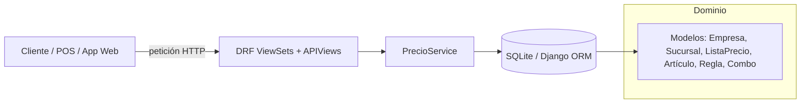

# Motor de Gestión de Precios 🧮

<div align="center">
  <span style="background:#2E86C1;color:#fff;padding:4px 12px;border-radius:999px;font-size:0.9rem;">Django 5.2 · DRF 3.16 · SQLite</span>
  <span style="background:#27AE60;color:#fff;padding:4px 12px;border-radius:999px;font-size:0.9rem;">API REST</span>
  <span style="background:#D35400;color:#fff;padding:4px 12px;border-radius:999px;font-size:0.9rem;">Motor de reglas</span>
</div>

---

## 1. ¿Qué hace este proyecto?

Es un **motor centralizado para gestionar precios comerciales** de una empresa multicanal. Permite:
- Definir empresas, sucursales y catálogos de productos.
- Crear **listas de precios** por canal (E-commerce, Tienda, etc.) con vigencias controladas.
- Configurar **reglas inteligentes** (por porcentaje, montos fijos, combinaciones y validaciones por volumen o monto de pedido).
- Calcular el **precio final autorizado** de un artículo en tiempo real, respetando costos mínimos y reglas de prioridad.

Todo está expuesto vía API REST para integrarse con e-commerce, POS o ERPs.

---

## 2. Vista rápida de la arquitectura



- **`core/`**: configuración base de Django y ruteo a la API (`core/urls.py`).
- **`gestion_precios/`**: app principal con modelos, vistas, servicios, serializadores y un comando de datos demo.
- **`PrecioService`** (`gestion_precios/services.py`): cerebro que decide qué lista aplicar, qué reglas disparar y valida venta bajo costo.

---

## 3. Modelos principales

| Capa | Modelo | Descripción | Archivo |
|------|--------|-------------|---------|
| Organización | `Empresa`, `Sucursal` | Contexto multiempresa/multisucursal. | `gestion_precios/models.py` |
| Catálogo | `LineaArticulo`, `GrupoArticulo`, `Articulo` | Agrupa SKUs y guarda costos, usado por reglas. | `gestion_precios/models.py` |
| Pricing | `ListaPrecio`, `PrecioArticulo` | Lista con vigencias + precios base por artículo. | `gestion_precios/models.py` |
| Reglas | `ReglaPrecio` | Define descuentos por porcentaje/monto, condiciones y prioridad. | `gestion_precios/models.py` |
| Promos | `CombinacionProducto` | Combinaciones tipo “compra A+B y gana…”. | `gestion_precios/models.py` |

> Las relaciones y validaciones clave (unicidad por lista/artículo, prioridad de reglas y autorización de venta bajo costo) viven en los `ModelViewSet` + serializadores de DRF (`gestion_precios/serializers.py`).

---

## 4. Cómo se calcula un precio

1. **Selección de lista vigente** (`PrecioService.obtener_lista_vigente`):
   - Filtra por empresa, estado activo y fechas de vigencia.
   - Prioriza lista más específica: sucursal + canal → sucursal + TODOS → empresa + canal → empresa + TODOS.
2. **Precio base**:
   - Busca `PrecioArticulo` correspondiente al SKU dentro de la lista.
3. **Motor de reglas** (`PrecioService.calcular_precio_final`):
   - Ejecuta reglas por prioridad (campo `prioridad`, menor = más urgente).
   - Soporta condiciones por cantidad, monto total o presencia de combinaciones en el carrito (`cart_items`).
   - Registra si alguna regla permite vender por debajo del costo.
4. **Validación de costo**:
   - Si el precio final < `ultimo_costo` y ninguna regla lo autorizó, se ajusta automáticamente al costo y se informa en la respuesta.
5. **Respuesta JSON**:
   - Lista aplicada, precio base, precio final unitario, total (precio final ✕ cantidad), reglas disparadas y flag `autorizado_bajo_costo`.

---

## 5. API expuesta (prefijo `/api/`)

| Método | Ruta | Descripción |
|--------|------|-------------|
| `GET` | `/api/calcular-precio/` | Calcula el precio final de un artículo según contexto y reglas. |
| `GET` | `/api/lista-vigente/` | Devuelve la lista de precios aplicable a un canal/sucursal. |
| CRUD | `/api/empresas/`, `/sucursales/`, `/articulos/`, `/lineas-articulo/`, `/grupos-articulo/` | Administración de catálogo base. |
| CRUD | `/api/listas-precio/`, `/precios-articulo/` | Gestión de listas y precios base. |
| CRUD | `/api/reglas-precio/`, `/combinaciones/` | Alta/baja/edición de reglas y combos promocionales. |

> Los endpoints CRUD provienen de los `ModelViewSet` registrados en `gestion_precios/urls.py`. El cálculo de precios usa las APIView `CalcularPrecioFinalAPIView` y `ObtenerListaVigenteAPIView`.

---

## 6. Ejemplos prácticos

### 6.1 Calcular precio de un carrito
```bash
curl -G http://127.0.0.1:8000/api/calcular-precio/ \
    --data-urlencode "empresa_id=1" \
    --data-urlencode "canal_venta=ECOMMERCE" \
    --data-urlencode "sucursal_id=1" \
    --data-urlencode "articulo_id=2" \
    --data-urlencode "cantidad=3" \
    --data-urlencode "monto_pedido=540.00" \
    --data-urlencode "cart_items=2,3"
```

**Qué muestra:**
- Lista aplicada, precio base y precio final resultante.
- Regla(s) activadas (por volumen, monto mínimo o combinación teclado+mouse).
- Si la venta fue autorizada bajo costo.

### 6.2 Consultar lista vigente
```bash
curl -G "http://127.0.0.1:8000/api/lista-vigente/?empresa_id=1&canal_venta=TIENDA&sucursal_id=2"
```
Devuelve los metadatos de la lista que se está usando para deducir precios en esa sucursal.

---

## 7. Puesta en marcha

> Requisitos: Python 3.12+, `pip`, entorno virtual recomendado.

```bash
# 1. Crear y activar entorno
python -m venv .venv
source .venv/bin/activate

# 2. Instalar dependencias
pip install -r requirements.txt

# 3. Aplicar migraciones
python manage.py migrate

# 4. (Opcional) Crear datos demo
python manage.py populate_data

# 5. Levantar el servidor
python manage.py runserver
```

- Panel de administración disponible en `http://127.0.0.1:8000/admin/` (crea un superusuario con `python manage.py createsuperuser`).
- La base por defecto es `db.sqlite3` en el root del proyecto (`core/settings.py`).

---

## 8. Datos de ejemplo (`populate_data`)

El comando `python manage.py populate_data` crea:
- 1 empresa, 2 sucursales (Lima y Arequipa).
- 4 artículos (Laptop, Mouse, Teclado, Silla) con sus líneas/grupos.
- 2 listas de precio (E-commerce Lima, Tienda Arequipa) + precios base.
- 5 reglas destacadas: descuentos porcentuales, monto fijo por volumen, regla global por monto y una combinación Teclado+Mouse.

Se limpia el catálogo antes de recargar datos para garantizar consistencia.

---

## 9. Checklist para exponer

1. **Contexto**: explicar que es un “motor de precios” multiempresa/multicanal.
2. **Modelo de datos**: mostrar la tabla anterior o el diagrama (Mermaid) destacando relaciones.
3. **Demo API**:
   - Ejecutar `populate_data`.
   - Mostrar `/api/listas-precio/` y `/api/reglas-precio/` desde browsable API.
   - Consumir `calcular-precio` con un cURL (ver sección 6.1) para evidenciar reglas y ajuste bajo costo.
4. **Reglas avanzadas**: enfatizar la combinación teclado+mouse y el control de autorización bajo costo.
5. **Siguientes pasos** (sugeridos): autenticación, UI para gestión de reglas, jobs para caducidad de listas.

---

## 10. Recursos clave para estudiar el código

| Archivo | Rol |
|---------|-----|
| `core/settings.py` | Configuración de Django y registro de apps. |
| `gestion_precios/models.py` | Modelo relacional completo y restricciones. |
| `gestion_precios/serializers.py` | Validaciones de negocio (solapamiento de vigencias, duplicidad de reglas). |
| `gestion_precios/services.py` | Algoritmo de cálculo y selección de listas. |
| `gestion_precios/views.py` | API REST (ViewSets + APIViews custom). |
| `gestion_precios/management/commands/populate_data.py` | Seeds para demos rápidas. |

---

<div align="center">
  <span style="color:#1ABC9C;font-weight:600;">Listo para producción →</span>
  añade autenticación, logging y despliegue a tu proveedor favorito.
</div>

